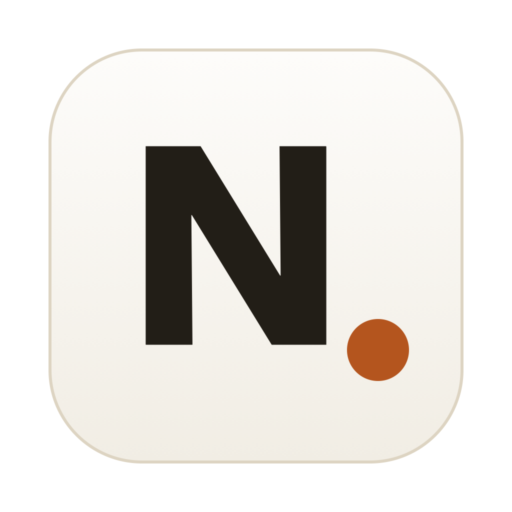

# Marknote

A local-first markdown notes app for macOS. Your notes are plain `.md` files in a
folder — no database, no cloud, no lock-in. Wraps a small zero-dependency Node
server in an Electron shell.



## Install (no tools needed)

Grab **Marknote-mac.zip** from a release (or from whoever built it), unzip,
drag **Marknote.app** to Applications and open it. The app is unsigned, so
Gatekeeper objects on first launch:

- **macOS 15 (Sequoia) and later**: the dialog has no Open option — press
  Done, then System Settings → Privacy & Security → scroll to the bottom →
  "Marknote was blocked…" → **Open Anyway**, then launch again
- **Older macOS**: right-click the app → Open → Open
- Terminal alternative: `xattr -d com.apple.quarantine /Applications/Marknote.app`

Your notes live as plain markdown in **~/Documents/Marknote/**.

**Windows (experimental)**: download **Marknote-win.zip**, unzip anywhere and
run `Marknote.exe` (SmartScreen: More info → Run anyway). Notes live in
`Documents\Marknote`. Untested by the maintainers — reports welcome! Optional
extras on Windows: ffmpeg downloads in-app; whisper-cli comes from the
whisper.cpp releases page (put it in `Documents\Marknote\bin\`).

Optional AI extras (everything else works without them):

- Transcription: `brew install whisper-cpp ffmpeg` + put `ggml-small.bin`
  ([download](https://huggingface.co/ggerganov/whisper.cpp/tree/main)) in
  `~/Documents/Marknote/models/`
- Summaries & todo suggestions: install the
  [Claude Code CLI](https://claude.com/claude-code) and sign in once

To build the zip yourself: `npm install && ./build-dist.sh` → `dist/Marknote-mac.zip`.


## Features

- **Plain markdown notes** with YAML front matter (title, labels, pinned) — grep-able,
  portable, and diff-friendly. Compatible with notes exported from Notable.
- **Rendered view** — GFM markdown, clickable task-list checkboxes that save back to
  the file, embedded images and video players
- **Mermaid diagrams** — rendered inline, plus a dedicated diagram editor with live
  preview, inline syntax errors, starter templates and a clickable per-type syntax
  cheat sheet that inserts snippets at your cursor
- **Note links** — type `[[` for an autocomplete of your notes; backlinks are listed
  under each note; renaming a note rewrites every reference to it
- **Search** — `/` filters the list (title, labels, full text); `⌘P` quick-open;
  `⌘F` find-in-note with highlights
- **Labels** — sidebar list with counts and filtering; edited in place on each note
- **Attachments** — paste (⌘V) or drag images/files into the editor
- **Video embeds** — a YouTube/Vimeo URL on its own line becomes a player
- **Meetings** — record from the mic on a dedicated page (timer, waveform,
  pause/resume, live notes field, crash-safe chunk mirroring, hourly still-recording
  reminder). Transcribe locally with whisper.cpp, get speaker-labelled transcripts
  and a summary of decisions/action items via the `claude` CLI.
- **Trash** — deletes are moves to `.trash/`, restorable from the app
- **Light/dark theme**, emoji picker, undo that works everywhere

## Setup

Requires macOS and [Node.js](https://nodejs.org) 20+.

```sh
git clone https://github.com/makam92/marknote.git
cd marknote
npm install
./build-app.sh        # builds /Applications/Marknote.app
open -a Marknote
```

Or run without installing: `npm start` (Electron window) or `npm run serve` and open
http://localhost:4747 in a browser.

Your notes live in `notes/` inside the project (created on first launch) as plain
markdown files. They are gitignored — this repository is only the app.

### Optional: meeting transcription

Transcription is fully on-device via [whisper.cpp](https://github.com/ggerganov/whisper.cpp):

```sh
brew install whisper-cpp ffmpeg
mkdir -p models
curl -L -o models/ggml-small.bin \
  https://huggingface.co/ggerganov/whisper.cpp/resolve/main/ggml-small.bin
```

The `small` model (~490MB) handles multilingual audio well; swap in another
[ggml model](https://huggingface.co/ggerganov/whisper.cpp/tree/main) if you like.

Speaker labelling and meeting summaries use the [Claude Code](https://claude.com/claude-code)
CLI (`claude`) if it's installed — each user's own account, nothing else leaves the
machine. Without it, you still get pause-based transcripts.

## Layout

```
notes/          your notes (plain markdown + YAML front matter) — gitignored
attachments/    images, audio, files — gitignored
.trash/         deleted notes, timestamped — gitignored
models/         whisper models — gitignored
public/         web UI (vanilla JS; marked, mermaid vendored)
server.js       zero-dependency Node HTTP server + file API
main.js         Electron wrapper
build-app.sh    assembles the .app bundle (thin launcher — code edits apply on relaunch)
```

## License

MIT — see [LICENSE](LICENSE).
